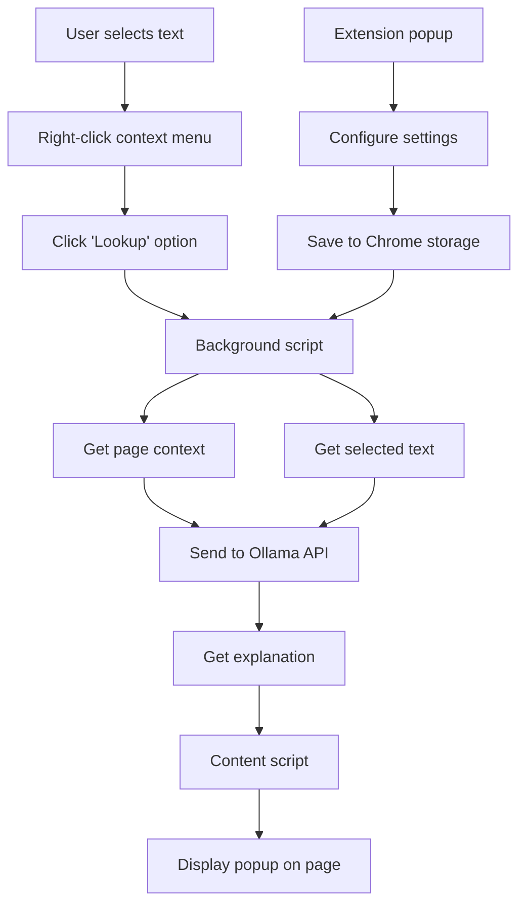
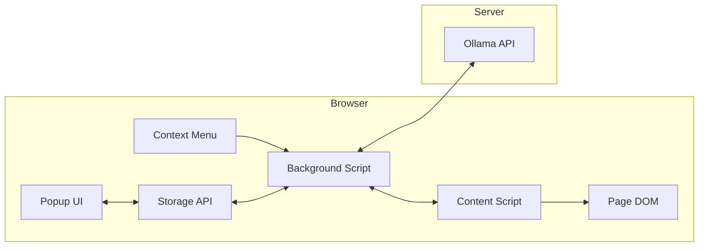
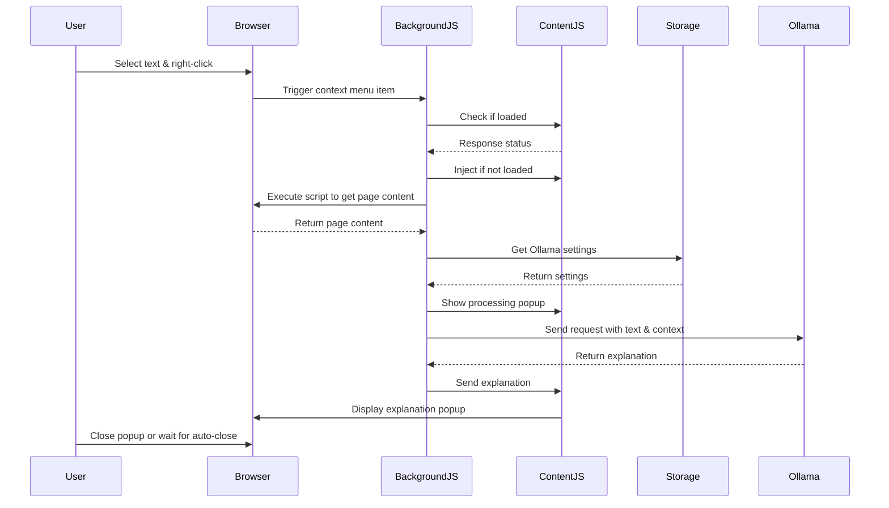
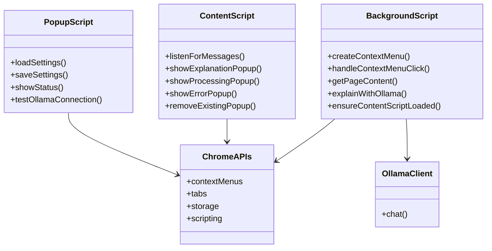

# GenLookup

<a href="https://peerlist.io/siddhartha/project/genlookup">
  <picture>
    <source media="(prefers-color-scheme: dark)" srcset="assets/launchpad/Launch_SVG_Dark.svg">
    <source media="(prefers-color-scheme: light)" srcset="assets/launchpad/Launch_SVG_Light.svg">
    
  </picture>
</a>

This browser extension adds an "Lookup" option to the right-click context menu when text is selected on any webpage. It sends the selected text along with the page context to an Ollama server for lookup.

https://github.com/user-attachments/assets/c17db7b9-a204-4ecf-bd24-d340e33633d4

## Installation

### Prerequisites

- Ollama installed and running on your computer or a remote server
- A browser that supports extensions (Chrome, Firefox, Edge)
- Node.js and npm (for building the extension)

### Building the Extension

1. Clone this repository
2. Install dependencies:
   ```
   npm install
   ```
3. Build the extension:
   ```
   npm run build
   ```
4. The complete extension will be available in the `dist` directory

### Chrome Installation

1. Build the extension as described above
2. Open Chrome and navigate to `chrome://extensions/`
3. Enable "Developer mode" by toggling the switch in the top right
4. Click "Load unpacked" and select the `dist` folder
5. The extension should now be installed and active

### Firefox Installation

1. Build the extension as described above
2. Open Firefox and navigate to `about:debugging#/runtime/this-firefox`
3. Click "Load Temporary Add-on..." and select the `manifest.json` file in the `dist` folder
4. The extension should now be installed and active

## Architecture Overview



## Components and Data Flow



## How It Works



## Features

- Adds "Lookup" to the right-click menu for selected text
- Sends selected text and page context to Ollama for explanation
- Shows explanation in a popup overlay on the page
- Configurable Ollama server URL and model
- Uses the official Ollama JavaScript client for reliable communication

## Usage

1. Select text on any webpage
2. Right-click to open the context menu
3. Click "Lookup" from the menu
4. Wait for the explanation to appear in a popup

## Technical Details

### Code Structure



### Key Files

- `manifest.json`: Extension configuration and permissions
- `background.js`: Service worker that handles context menu creation, text extraction, and Ollama API communication
- `content.js`: Creates and manages popup UI for displaying explanations on web pages
- `popup.html` and `popup.js`: Settings interface for configuring the Ollama server URL and model

### Background Script

The background script is the backbone of the extension:

- Sets up the context menu item when the extension is installed
- Handles clicks on the "Lookup" menu item
- Extracts the selected text and page context
- Communicates with the Ollama API using the official client
- Manages communication with the content script

### Content Script

The content script manages the UI elements:

- Creates popups for showing the explanation, processing state, or errors
- Handles message passing with the background script
- Formats and displays the explanation with basic Markdown support
- Manages popup positioning and dismissal logic

### Page Context Extraction

When the user selects text for explanation, the extension:

1. Extracts the selected text directly from the browser
2. Executes a function in the page context to get surrounding content
3. Converts the page's HTML to a simplified Markdown format
4. Sends both the selected text and the page context to Ollama
5. This provides more relevant explanations by including context

## Configuration

Click on the extension icon in your browser toolbar to:

1. Set the Ollama Server URL (default: `http://localhost:11434`)
2. Choose the model to use (default: `llama3`)
3. Click "Save Settings" to apply changes

## Development

To work on the extension:

1. Make changes to the source files
2. Run `npm run build` to rebuild the extension
3. For continuous development, use `npm run watch` to automatically rebuild when files change
4. Reload the extension in your browser to see the changes

## Notes

- Ensure Ollama is running before using the extension
- The extension needs permission to read the content of web pages to provide context
- The extension works best with models that are good at explanations
- The extension uses the official Ollama JavaScript client but still requires proper CORS configuration

## CORS Configuration

To avoid Cross-Origin Resource Sharing (CORS) issues when connecting to Ollama from the extension, you need to configure your Ollama server properly:

### macOS

Run these commands in Terminal:

```bash
launchctl setenv OLLAMA_HOST "0.0.0.0"
launchctl setenv OLLAMA_ORIGINS "chrome-extension://*"
```

Then restart Ollama for the changes to take effect.

### Linux and others

For more details on setting environment variables on Linux, Windows etc, refer to the [Ollama FAQ](https://github.com/ollama/ollama/blob/main/docs/faq.md#setting-environment-variables-on-linux).
